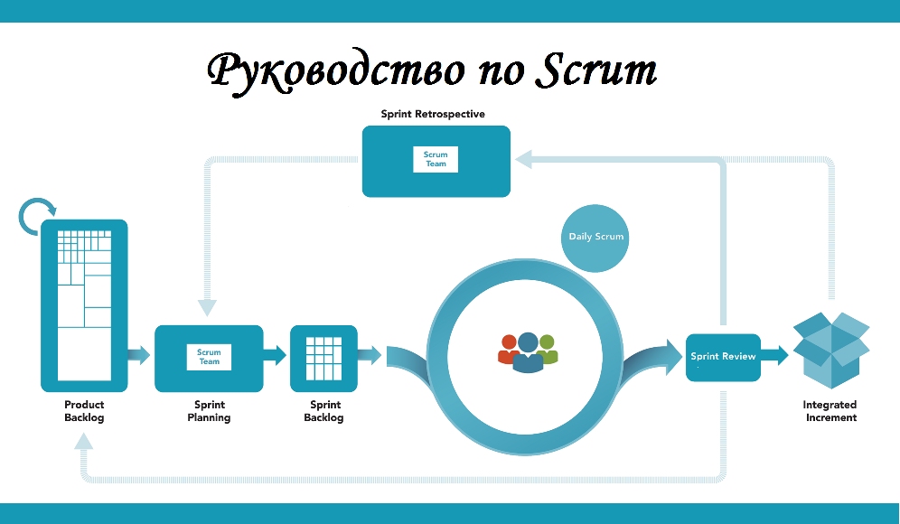

# Введение

## `Scrum`

- Использует итеративный, инкрементальный подход для оптимизации прогнозируемости и управления рисками. 
- Основан на принципах [`LEAN`](../../`LEAN`.md), [`Timeboxing`](../../`Timeboxing`.md) и полностью отражает ценности [agile manifesto](../../agile%20manifesto.md)
- Позволяет в жёстко фиксированные  и  небольшие   итерации,   предоставлять  работающее  ПО  с  новыми  возможностями

## `Sprint` 

- Это ограниченная по времени итерация непрерывной разработки ПО в Scrum, в рамках которого команда должна выполнить запланированный объем работы.
- Цель  спринта  —  поставить  `Increment`  с работающей  функциональностью  конечным пользователям. 
- Все проекты Scrum разбиваются на спринты, которые дляться от 1 до 4х недель

## Принципы Scrum

- В основе Scrum лежат три главных принципа  управления эмпирическими процессами: 
	- transparency (прозрачность)
	- inspection (проверка)
	- adaptation (адаптация)

## Мероприятия Scrum

- Скрам предписывает четыре формальные возможности для проверки и адаптации: 
	-   **Планирование Спринта** (Sprint Planning Meeting)
	-   **Ежедневный Скрам** (Daily Scrum)
	-   **Обзор Спринта** (Sprint Review Meeting)
	-   **Ретроспектива Спринта** (Sprint Retrospective)

## Роли в Scrum 

- **Скрам-мастер**  **(Scrum  Master)**
	- проводит  Scrum  meetings,  следит  за соблюдением принципов скрама, разрешает противоречия и защищает команду от отвлекающих факторов.  
	-  Учит и ведет за собой Команду

- **Владелец продукта (Product Owner)**
	- представляет интересы конечных пользователей и заинтересованных сторон, определяет приоритеты и передает требования команде. 
	- ответственен за достижение максимальной ценности

- **Команда  Разработки  (Development  Team)** 
	- самоуправляемая, кросс-функциональная  команда разработчиков до  9  человек, отвечает за результат как единое целое.  
	- максимизирует возможность обратной связи
	- в Команде нет структурных подразделений, например тестирования или бизнес-анализа.

- **Бизнес-аналитик может иметь следующие роли на проекте:** 
	- Product Owner 
	- Team  member   
	- Proxy Product Owner 

# Артефакты в Scrum
## Product  Backlog

- Это  список требований к реализации, упорядоченные по приоритету, необходимости, ценности и риску.
- Ответственность за приоритеты и требования несет владелец продукта. 
- Это единственный источник требований для любых изменений
- Он никогда не является полным. Начальная версия  содержит только первоначально известные и понятные требования. 
- Он постоянно обновляется по мере изменения продукта и внешних факторов
-  Деятельность по добавлению деталей, оценок затрат времени, и упорядочивания элементов называют [Backlog Maintenance (Поддержание бэклога)](../Backlog%20Maintenance%20(Поддержание%20бэклога).md)

## Backlog Item (элемент)

- Это составная часть бэклога продукта,  которую  необходимо выполнить.
- Может быть как:
	- [`Epic`](../../`Epic`.md)
	- [`User Story`](../../`User%20Story`.md)
	- Task, Subtask
	- Spike (исследовательская задача)
	- Bug
- Элементы с высоким уровнем приоритетности должны быть более понятными и содержать больше деталей, чем менее приоритетные.
- Требования, над которыми команда будет работать во время текущего Спринта, должны быть разбитыми таким образом, чтобы их возможно было выполнить за один Спринт.

## Sprint  Backlog
- это  набор  элементов  _Product  Backlog_,  выбранных  для выполнения в текущем спринте для разработки инкремента и достижения цели спринта. 
- В любое время во время Спринта можно подытожить количество оставшейся работы
- Каждый Спринт можно считать проектом с временными рамками до одного месяца

## `Increment`
- это все выполненные требования реализованные во время текущего спринта
- он является дополнением ко всем предыдущим итерациям. 
- он должен быть пригодным для использования иначе он не принесет ценности
- это конкретная ступень к достижению Product Goal. 

## `Burndown  Chart` (Диаграмма  сгорания  задач)
- Это диаграмма,  показывающая  количество сделанной и оставшейся работы на каждый день спринта и позволяющая оценить текущий прогресс команды по достижению цели спринта. 
- см.
	- [Sprint Burn Down Chart - Quickscrum](../../Sprint%20Burn%20Down%20Chart%20-%20Quickscrum.md)
	- [Диаграмма выгорания (Burndown Scrum Sprint)](Диаграмма%20выгорания%20(Burndown%20Scrum%20Sprint).md)
	- [Лимиты WIP — определение и важность](https://www.knowledgehut.com/tutorials/scrum-tutorial/wip-limits)

# Церемонии Scrum

добавить из [Церемонии на Scrum проектах](../../Церемонии%20на%20Scrum%20проектах.md)

## Backlog refinement, grooming (Чистка бэклога)

- Процесс проверки новых элементов бэклога продукта на предмет ясности, оценки и приоритета. Встреча Владельца продукта и Команды Разработки для актуализации самой приоритетной части [Backlog product](../../Backlog%20product.md).
- Задачи in grooming: 
	- Обсудить с командой требования к продукту 
	- Обеспечить оптимальную декомпозицию требований 
	- Определить и заполнить неполноту Бэклога Продукта 
	- Определить противоречия между элементами
	- Определить внешние зависимости и риски при выполнении задач
	- ранжировать элементы  по приоритету 
- Цель — подготовить самую приоритетную на данный момент часть _Backlog product_ к ближайшему спринту.
[`Backlog grooming`](../../`Backlog%20grooming`.md)

### Definition of Ready (DoR)

- Когда Инкремент назван “готовым”, все должны понимать, что означает “Готово”
- Целью каждого Спринта является разработка Инкремента потенциально готовой к выпуску функциональности, отвечающей текущему определению “Готовности” Скрам Команды.
- Одно и то же определение помогает Команде в понимании того, сколько требований выбрать из Журнала
- см. [Definition of Ready (DoR)](INBOX/Definition%20of%20Ready%20(DoR).md)
## Sprint Planning (Планирование Спринта)

- Это встреча Владельца Продукта и Команды Разработки, на которой они решают, что будут делать в этом Спринте. 

- Проводится в первый день спринта  и включает в себя шаги: 
	- Из Бэклога Продукта выбираются [`User Story`](../../`User%20Story`.md), и команда берет на себя обязательства выполнить их за спринт
	- Команда выбирает  user story/bag из бэклога продукта и наполняет бэклог спринта задачами и подзадачами. 
	- Обсуждаются технические детали реализации 
	- Команда Разработчиков планирует такой объем работы, который она в состоянии выполнить за Спринт. 
	- члены Команды ищут ответы на следующие вопросы:
		-   Что будет разработано в Инкременте
		-   Как эффективно выполнить работу 
- Каждая история оценивается в ([story  points](../../story%20%20points.md))
- Команда может пригласить людей со стороны, чтобы они посоветовали что-то с технической или же экспертной точки зрения. 
- При отмене Спринта все выполненные и “готовые” элементы из Журнала Продукта пересматриваются. 

### Story Points (Очки за User Story)
- абстрактная метрика оценки сложности пользовательской истории, которая не учитывает затраты в человеко-часах. 
- Назначается каждой пользовательской истории на планинге путем голосования всех членов команды. 
- Обычно используют одну из следующих шкал: 
	- ряд Фибоначчи (1,2,3,5,8,13,21,34,55); 
	- линейную шкалу (1,2,3,4 … n); 
	- степень двойки (1,2,4,8 … 2n);
	- размеры одежды **(T-shirt sizes)** (XS, S, M, L, XL). 

### Velocity (Скорость команды)
- общее количество очков, набранных командой за предыдущий спринт. Данная метрика помогает команде понять, сколько историй она может сделать за один спринт. 

##   Daily  scrum,  standup  (Ежедневный  Скрам)
- Ежедневная  встреча  команды  разработки,  на которой она анализирует сделанное за последние сутки и прогнозирует оставшуюся на день работу.
- Ежедневный скрам помогает Команде следить за постепенным приближением к цели спринта. 
- Каждый член команды разработки отвечает на три вопроса:  
	- что я делал со времени прошлой встречи?
	- Что я планирую сделать до следующей встречи? 
	- есть ли у меня препятствия для выполнения задачи
- не является статус-совещанием, а скорее совещанием для _синхронизации_ членов Команды

## Sprint Review, Demo (Обзор Спринта)

- Презентация обновленного продукта заинтересованным лицам,  клиентам  и  владельцу  продукта. 
- проводится в конце Спринта для проверки Инкремента 
- нужен,  чтобы  получить  отзывы  на обновлённый Продукт и скорректировать его дальнейшее развитие. 
 - включает в себя следующие шаги:
	-   Владелец Продукта определяет, что является “готовым”, а что нет;
	-   Команда Разработчиков вспоминает, что прошло гладко во время Спринта и с чем возникли трудности
	-   Команда проводит демонстрацию и отвечает на вопросы 
	-   Владелец Продукта делает предположения касательно возможной даты окончания проекта, принимая во внимание скорость продвижения
	-   Участники  обсуждают что делать, чтобы данный Обзор Спринта предоставлял важную входную информацию для последующей встречи по планирования Спринта.

## Sprint Retrospective (Ретроспектива)

- Встреча Скрам-мастера, владельца продукта и команды разработки, на которой обсуждают с какими проблемами в отношениях, инструментах и процессах столкнулась команда и как их можно исправить.
- Ретроспектива происходит после Обзора Спринта и перед последующим Планированием Спринта. 
-  Команда ищет пути улучшений которые можно  внести в следующий Спринт.   и при необходимости уточняя определение “Готовности”.  
- Целью Ретроспективы является:
	-  Проверить насколько успешно прошел Спринт, учитывая слаженность Команды, процессы и использованные инструменты;
	-  Разработка плана по улучшению работы команды
- _action point_ - корректирующие действие на конкретного человека.

# Прогресс на пути к Цели

- В любое время можно подытожить количество работы, которую осталось сделать для достижения Цели. 
- Владелец Продукта отслеживает оставшееся количество работы, как минимум, для каждого Обзора Спринта. 
- Для предсказания прогресса используются графики отображающие реальное продвижение, отклонение, и ожидаемое движение 
	- Burndown  Chart (сколько осталось)
	- burnup (сколько сделано)

## Последовательность действий

- Собираем [backlog](backlog.md) проекта по Hi-level. 
- Выбираем главные 2-3 фичи на первый спринт
- Описываем эти фичи через [User Story](User%20Story.md) и [Разработку требований](../../советы%20для%20хороших%20требований.md)
- Делаем черновик спринта и готовимся к Backlog refinement он ж _grooming_ (чистке бэклога), чтобы проработь и детализировать элементы _бэклога продукта_
- Проводим _груминг_ с [Estimation](INBOX/Estimation%20(оценка).md) и приоритизацией
- Проверяем качество требований на основе [Definition of Ready (DoR)](Definition%20of%20Ready%20(DoR).md)

> эстимация и приоритизация это разное. 
> 
> эстимацию можно делать без оценки!

приоритеты ставим через  [MoSCoW](../../MoSCoW.md) 

# Metadata
- Type:: #статья 
- Status:: #done 
- Location:: #офис  
- Project:: [0_Бизнес аналитик `BA`](../../0_Бизнес%20аналитик%20`BA`.md)
- Topic:: [Scramban](https://kanbantool.com/scrumban-kanban-and-scrum)
- Back link:: [Agile](../../Agile.md) [Церемонии на Scrum проектах](../../Церемонии%20на%20Scrum%20проектах.md)
- Source:: [Scrum in 3 Minutes](https://www.visual-paradigm.com/scrum/scrum-in-3-minutes/) [Цель Руководства по Скраму](https://analytics.infozone.pro/scrum-guide-schwaber-and-sutherland/#i)
